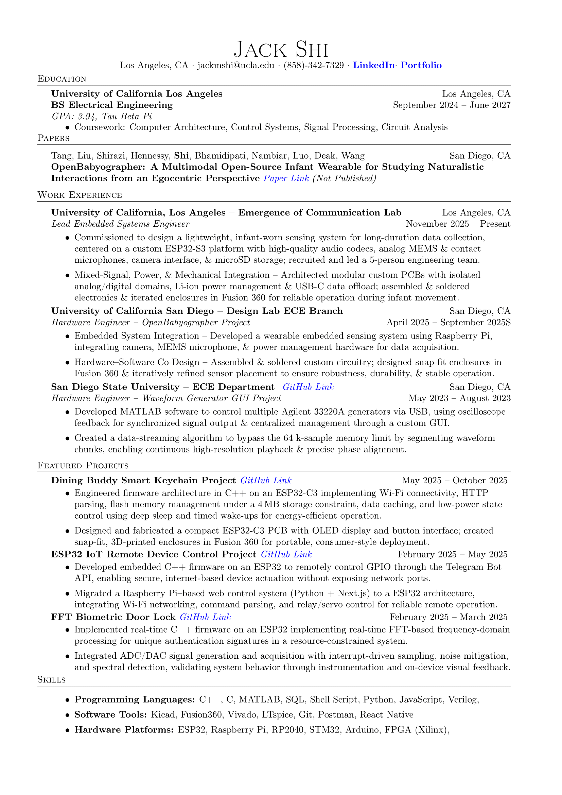

# Biography

Jack Shi is an Electrical Engineering student at UCLA with a focus on embedded systems, circuit design, and hardware prototyping. He has co-authored a paper submitted to ACM CHI 2026 on wearable sensing technology and completed research internships at UC San Diego and San Diego State, gaining experience in system design, MATLAB programming, and full-stack development. Outside of academics, Jack builds personal projects such as custom PCBs, smart keychains, and device restorations, combining technical precision with creative design. He is passionate about applying engineering to solve real-world problems and is actively seeking opportunities in hardware and embedded systems.

# Resume

# Projects

View my featured projects below. Visit my public repositories to see all my projects.

<!---
jackshisd/jackshisd is a ✨ special ✨ repository because its `README.md` (this file) appears on your GitHub profile.
You can click the Preview link to take a look at your changes.
--->
