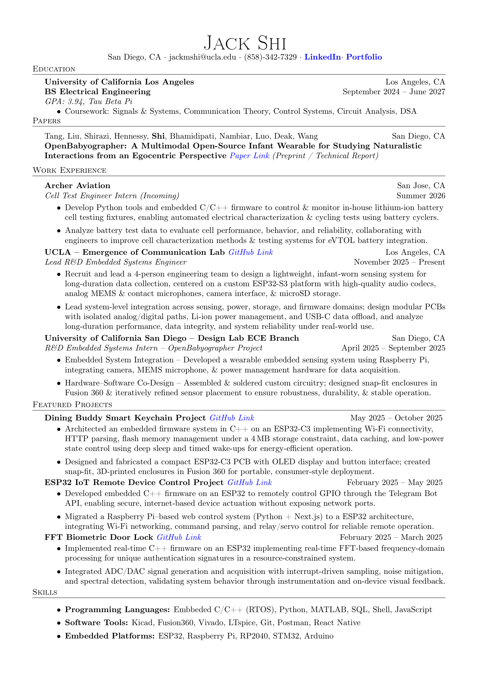

# Biography

I am an Electrical Engineering student at UCLA and incoming Cell Test Engineering Intern at Archer Aviation with a strong focus on embedded systems, circuit design, and hardware prototyping. I am currently working in UCLA’s Emergence of Communication Lab, where I help design and integrate wearable sensing systems for infant research studies, spanning system architecture, PCB design and assembly, and embedded firmware development. I am also a co-author on a paper submitted to ACM CHI 2026 on wearable sensing technology.

# Resume

# Projects

View my featured projects below. Visit my public repositories to see all my projects.

<!---
jackshisd/jackshisd is a ✨ special ✨ repository because its `README.md` (this file) appears on your GitHub profile.
You can click the Preview link to take a look at your changes.
--->
